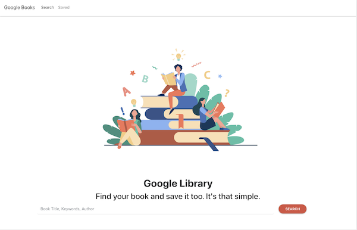

# Google Library

  

  ## Deployed
  https://google-library-hn.herokuapp.com/

  ## Description 
  Google Library is a full-stack application built with MERN stack. Use Google Library to search for books, authors, or keywords and save books for later. The UI integrates Google colors, bootstrap components and clean, intuitive functionality. 

  

  ## Table of Contents
  * [Installation](#installation)
  * [Usage](#usage)
  * [License](#license)
  * [Contributing](#contributing)
  * [Test Instructions](#test-instructions)
  * [Questions](#questions)

  ## Installation
    
    1. To use this code for your own project, download the Google-Library repository locally to your computer.
    2. Navigate to the Google-Library directory on your terminal
    2. Run npm install in your bash/command line to install dependencies listed in the 'package.json' file.

  ## Usage
      
    1. To run application, invoke with npm start in your bash/command line. 
    2. View the live application in your browser at localhost:3000

  ## License
  MIT (c) Hoang Nguyen   
  See LICENSE.md for details.

  ## Contributing
  Please check the app's GitHub issue tracker for known issues. Report bugs and requests to GitHub Issues.

  ## Test Instructions
  Install and run the application per instructions above. Check your terminal and web console for errors.

  ## Questions
  For questions, reach out to the team and I here:  
  Github: https://github.com/hngdngng  
  Email: [hoang.d.nguyen@outlook.com](mailto:hoang.d.nguyen@outlook.com)
  
